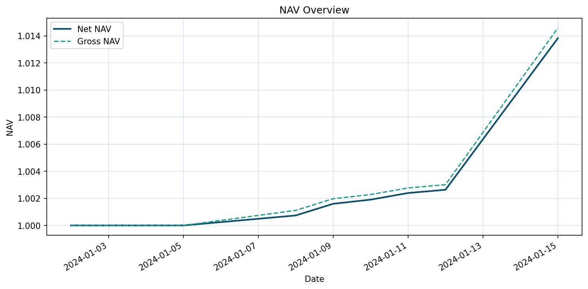
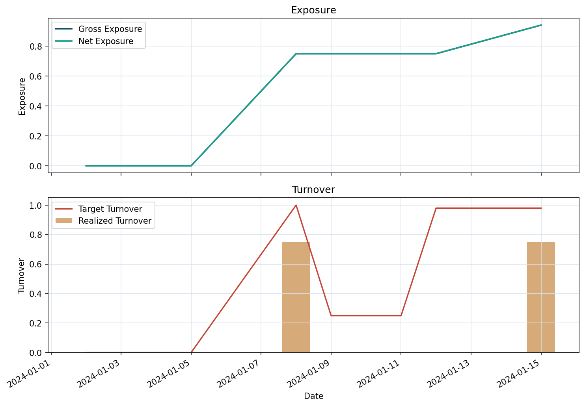
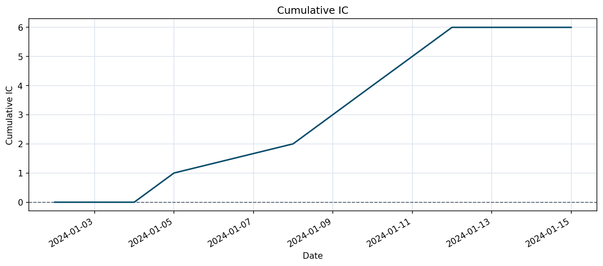
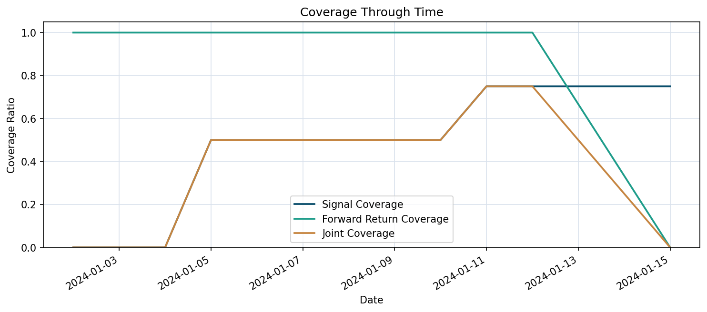
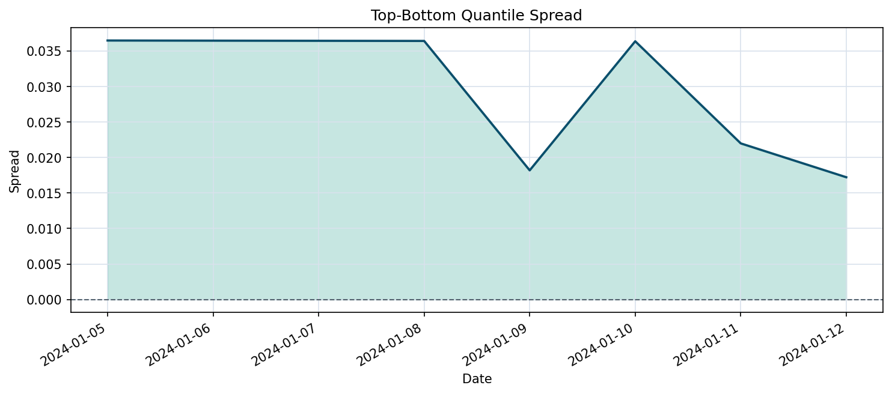
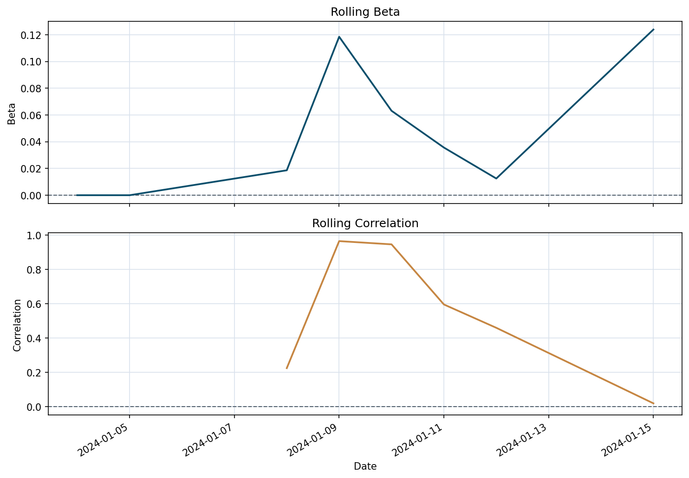
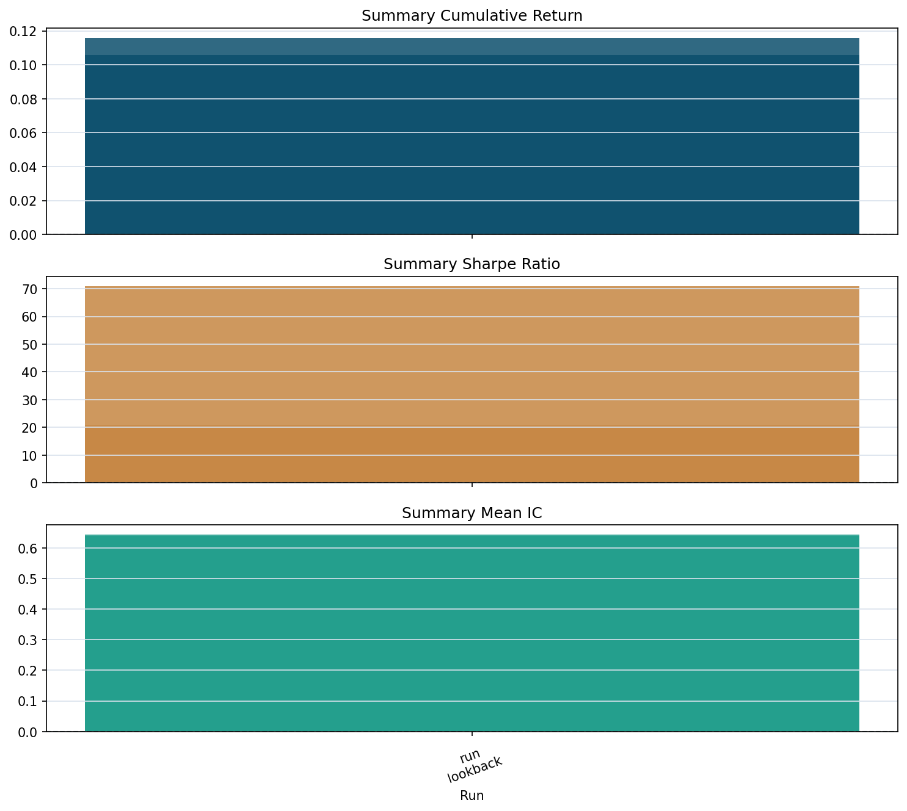

# Results

This page summarizes representative outputs regenerated from the current repository state. Every metric, table, and figure below comes from rerunning bundled configs and refreshing the committed artifacts under `artifacts/`.

The bundled datasets are synthetic and only 10 trading dates long. These results are useful for checking timing, diagnostics, reproducibility, and report packaging. They are not evidence of deployable alpha.

## Overview

The strongest signals in the current outputs are:

- lagged and auditable universe filtering
- explicit execution and benchmark-relative accounting
- full report packaging with text, metadata, charts, and HTML
- lightweight research workflow tracking with sweep, walk-forward, and compare-runs

## Data And Universe Filtering

Primary config:

- `configs/stage1_universe_example.toml`

`validate-data` summary:

| Metric | Value |
| --- | --- |
| Eligible Rows | `17/40` |
| Eligible Symbols Ever | `3/4` |
| First Eligible Date | `2024-01-05` |
| Representative Exclusion Reasons | `below_min_average_dollar_volume=9`, `insufficient_listing_history=8`, `insufficient_average_volume_history=8`, `below_min_price=6` |

Research dataset excerpt from `build-dataset`:

```csv
date,symbol,universe_filter_date,universe_lagged_close,passes_universe_min_price,passes_universe_min_average_volume,passes_universe_min_average_dollar_volume,passes_universe_min_listing_history,is_universe_eligible,universe_exclusion_reason
2024-01-03,AAPL,2024-01-02,100.0,True,False,False,False,False,insufficient_listing_history;insufficient_average_volume_history;insufficient_adv_history
2024-01-04,AAPL,2024-01-03,101.0,True,False,False,False,False,insufficient_listing_history;insufficient_average_volume_history;insufficient_adv_history
2024-01-05,AAPL,2024-01-04,103.0,True,True,True,True,True,
```

The important point here is not the pass rate by itself. The important point is that tradability-aware filtering is explicit and lagged: the dataset stores the reference date, lagged close, per-rule pass flags, final eligibility, and a human-readable exclusion reason.

## Execution And Benchmark-Aware Backtest

Primary config:

- `configs/stage3_benchmark_example.toml`

Execution and accounting behavior:

| Item | Value |
| --- | --- |
| Rebalance Frequency | `weekly` |
| Max Turnover | `0.75` |
| Commission / Slippage | `2.0 / 3.0 bps` |
| Benchmark-Relative Columns | `benchmark_return`, `excess_return`, `benchmark_nav`, `relative_nav` |
| Execution Diagnostics | `is_rebalance_date`, `turnover_limit_applied`, `target_turnover`, `turnover` |

Selected backtest rows from `run-backtest`:

| Date | Rebalance Date | Turnover Limit Applied | Commission Cost | Slippage Cost | Benchmark Return | Excess Return | Relative NAV |
| --- | --- | --- | ---: | ---: | ---: | ---: | ---: |
| `2024-01-08` | `True` | `True` | `0.00015` | `0.000225` | `0.005` | `0.005942` | `0.993965` |
| `2024-01-15` | `True` | `False` | `0.00005` | `0.000075` | `0.005` | `0.008908` | `1.032252` |

This section is about accounting behavior rather than return maximization. The useful part is that benchmark-relative columns and execution-limit diagnostics are first-class outputs of the engine, not manual post-processing.

## Full Report Artifact

Primary config:

- `configs/stage4_flagship_example.toml`

Primary artifact bundle:

- `artifacts/stage4_report/`
- HTML report: [artifacts/stage4_report/index.html](artifacts/stage4_report/index.html)

Headline metrics from `artifacts/stage4_report/metadata.json`:

| Metric | Value |
| --- | ---: |
| Cumulative Return | `1.38%` |
| Max Drawdown | `0.00%` |
| Excess Cumulative Return | `-1.90%` |
| Tracking Error | `7.27%` |
| Mean IC | `1.00` |
| Joint Coverage Ratio | `35.00%` |
| Top-Bottom Quantile Spread | `2.78%` |
| Turnover Limit Applied Dates | `2/10` |

This flagship example intentionally keeps a negative benchmark-relative result visible. The benchmark cumulative return was `3.34%` while the strategy cumulative return was `1.38%`, which produces `-1.90%` excess cumulative return. That is useful because it shows the benchmark-relative reporting path is honest and explicit rather than cherry-picked.

The Stage 4 artifact bundle also contains `report.txt`, `metadata.json`, a 10-chart PNG bundle, and a self-contained HTML report page.

### Selected Charts













## Research Workflow And Run Comparison

Experiment root:

- `artifacts/showcase_runs/`

Compare artifact:

- `artifacts/showcase_compare_report/`

Current workflow highlights:

| Workflow | Result |
| --- | --- |
| Parameter Sweep | Best in-sample candidate is `lookback=2` with `11.60%` cumulative return, `20.71` Sharpe, and `0.64` mean IC. |
| Walk-Forward | `lookback=2` is selected in all 3 folds; overall out-of-sample cumulative return is `10.58%` with `0.64` mean IC. |
| Compare-Runs | Best cumulative-return run is `sweep-signal`; best mean-IC run is `walk-forward-signal`. |

Walk-forward fold summary from `artifacts/showcase_compare_report/report.txt`:

| Fold | Selected Value | Test Cumulative Return | Test Mean IC | Joint Coverage |
| --- | ---: | ---: | ---: | ---: |
| `1` | `2` | `3.85%` | `0.59` | `100.00%` |
| `2` | `2` | `2.78%` | `0.71` | `100.00%` |
| `3` | `2` | `3.60%` | `0.63` | `50.00%` |

This is the main research workflow story in the repo: lightweight artifacts, a simple run index, explicit sweep and walk-forward outputs, and a small comparison layer that can summarize multiple runs without introducing a heavy experiment tracking system.

### Compare-Runs Chart



## Reproducibility

Commands used for the current committed artifacts and command outputs:

```bash
./.venv/bin/alphaforge validate-data --config configs/stage1_universe_example.toml
./.venv/bin/alphaforge build-dataset --config configs/stage1_universe_example.toml
./.venv/bin/alphaforge run-backtest --config configs/stage3_benchmark_example.toml
./.venv/bin/alphaforge report --config configs/stage4_flagship_example.toml --artifact-dir artifacts/stage4_report
./.venv/bin/alphaforge plot-report --config configs/stage4_flagship_example.toml --output-dir artifacts/stage4_charts
./.venv/bin/alphaforge sweep-signal --config configs/momentum_example.toml --parameter lookback --values 1 2 3 --experiment-root artifacts/showcase_runs
./.venv/bin/alphaforge walk-forward-signal --config configs/momentum_example.toml --parameter lookback --values 1 2 3 --train-periods 4 --test-periods 2 --experiment-root artifacts/showcase_runs
./.venv/bin/alphaforge compare-runs --experiment-root artifacts/showcase_runs --limit 2 --artifact-dir artifacts/showcase_compare_report
./.venv/bin/python -m pytest -q
```

Current repository validation:

- `139 passed, 14 warnings in 15.40s`
- the warnings come from `matplotlib/pyparsing` deprecations, not from AlphaForge business logic
